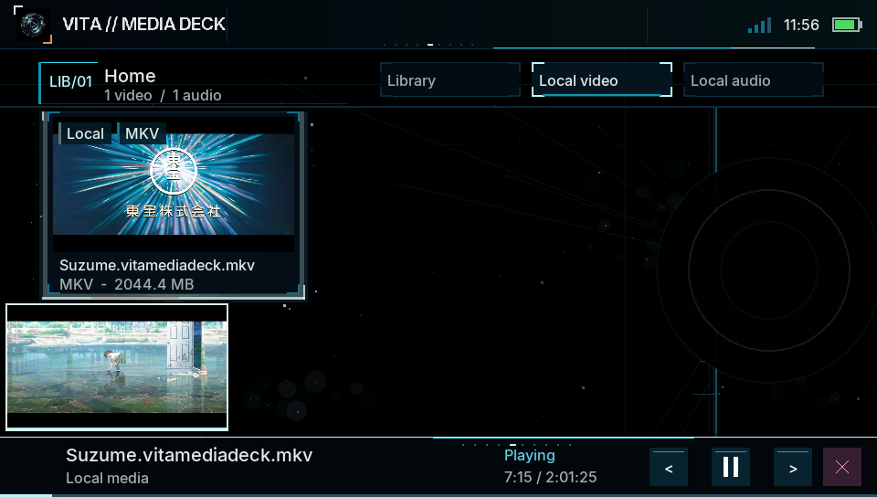
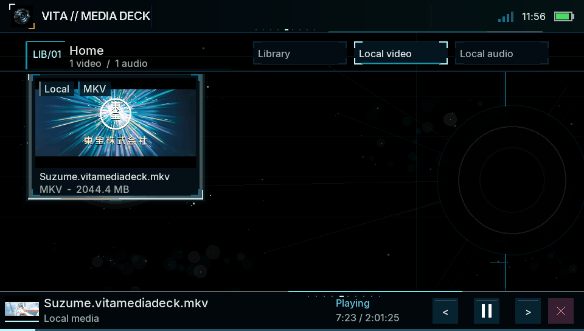

# VitaMediaDeck

[](LICENSE)

<p align="center">
  
</p>

<p align="center">
  <strong>A native local and authenticated-network media player for PlayStation Vita.</strong>
</p>

> [!IMPORTANT]
> **Public beta** — VitaMediaDeck is available publicly but remains in active
> development. Validate playback and network sources on your own PlayStation
> Vita before relying on it day to day.

VitaMediaDeck plays video and music stored on the Vita and video from Jellyfin
or authenticated WebDAV, SFTP, and SMB servers. Browsing, demuxing, decoding,
synchronization, and rendering run directly on the console.

The **Spectral Reassembly** interface combines pitch-black OLED fields,
spectral-cyan controls, cold blue/teal atmosphere, restrained amber telemetry,
particle clouds, and scan traces. Its visual and multilingual typography
contract is documented in [UI_SIGNAL_SHELL.md](mds/UI_SIGNAL_SHELL.md).

## Running on PlayStation Vita

<table>
  <tr>
    <td colspan="2" align="center">
      
    </td>
  </tr>
  <tr>
    <td colspan="2" align="center"><sub>Hardware H.264 playback on a physical PlayStation Vita</sub></td>
  </tr>
  <tr>
    <td width="50%" align="center">
      
    </td>
    <td width="50%" align="center">
      
    </td>
  </tr>
  <tr>
    <td align="center"><sub>Expanded live mini-player and embedded cover</sub></td>
    <td align="center"><sub>Compact live mini-player and embedded cover</sub></td>
  </tr>
</table>

## Highlights

- Local video and music libraries on `ux0:` and `uma0:`, with paged indexing,
  folder browsing, and persistent grid/list views.
- Native Jellyfin library browsing with memory-only access tokens, server
  posters, rich item records, and seekable direct play over HTTPS or explicitly
  selected LAN HTTP. Detail records include synopsis, original/series title,
  year, runtime, ratings, genres, studios, directors, cast, watched/favorite
  state, and audio/subtitle summaries.
- Authenticated remote video browsing through WebDAV over HTTPS, SFTP with a
  confirmed SHA-256 host fingerprint, and signed SMB2/SMB3 sessions.
- Hardware-first H.264 playback with an automatic CPU/FFmpeg fallback.
- Indexed H.264 cue seeking for startup, live seek, saved-position resume, and
  AAC track replacement without multi-stream linear-seek fallbacks. Jellyfin
  maps each cue hop to a directly aligned HTTP Range window and keeps its
  prefetch worker alive across the decoder's temporary seek cancellation.
- Runtime switching between multiple AAC audio tracks and embedded SubRip,
  ASS/SSA, WebVTT, MOV text, plain-text, or MicroDVD subtitles.
- Jellyfin text subtitles, including server-extracted embedded tracks, are
  discovered from provider metadata and fetched on demand as bounded SRT
  responses. This avoids reopening and probing the complete remote movie for
  subtitle changes.
- Configurable multilingual subtitles with font profiles for Western, Cyrillic,
  Japanese, Chinese, and Korean text; foreground, background, border, four
  sharp size tiers, width, row-count, and true top/bottom position controls;
  and a full-width Settings preview.
- Grid covers from sidecar or embedded artwork, with bounded representative
  H.264 frame extraction and persistent caching when artwork is unavailable.
- Per-video resume history for local and remote media, plus explicit restart
  from the beginning.
- Live video mini-player, persistent music mini-player, full-screen music
  player, artwork, metadata, shuffle, repeat, and seeking.
- Player telemetry for backend, resolution, frame rate, and video bitrate,
  including a calculated fallback when the container omits bitrate metadata,
  plus a colored timeline trace and numeric reserve for the currently resident
  Jellyfin byte range.
- VitaTube-style controls: press Start to minimize, hold Start for OLED ECO
  mode, and hold Select for 900 ms to lock or unlock player input.

## Project family

The playback stack is split into reusable repositories. The decoder packages
are included in the application build; the Transcoder is an optional desktop
tool and is not part of the VPK.

| Repository | Purpose |
| --- | --- |
| [`VitaMediaDeck`](https://github.com/spyro-98/VitaMediaDeck) | PS Vita application, media library, network browsing, subtitles, covers, mini-player, and playback orchestration |
| [`vita-hw-decoder`](https://github.com/spyro-98/vita-hw-decoder) | Hardware-only H.264/AAC backend using `h264_vita`, SceVideodec, and direct NV12/P2 presentation |
| [`vita-sw-decoder`](https://github.com/spyro-98/vita-sw-decoder) | API-compatible CPU/FFmpeg H.264 fallback with the same stream and lifecycle contract |
| [`VitaMediaDeck-Transcoder`](https://github.com/spyro-98/VitaMediaDeck-Transcoder) | Optional macOS, Windows, and Linux tool for producing Vita-oriented H.264/AAC Matroska files with multiple tracks and embedded covers |
| [`vita-https`](https://github.com/spyro-98/vita-https) | Hardened HTTPS lifecycle, certificate/SPKI verification, and seekable Range transport used by Jellyfin and WebDAV |

The Transcoder preserves selected audio and subtitle tracks, chapters,
language/title metadata, compatible font attachments, and existing artwork. If
no usable cover exists, it extracts and embeds a representative 480×272 frame.
It also provides Vita-oriented quality presets, HDR-to-SDR tone mapping, final
stream validation, and both command-line and interactive terminal interfaces.

## Media sources

| Source | Access contract | Current scope |
| --- | --- | --- |
| Local storage | Vita filesystem | Video and audio |
| Jellyfin | HTTPS on port 8920, or explicitly selected unencrypted LAN HTTP on port 8096; memory-only access token and byte ranges | Video libraries, server posters, direct play |
| WebDAV | HTTPS, verified certificate or confirmed SPKI pin, and byte ranges | Remote video |
| SFTP | Username/password and confirmed SHA-256 host fingerprint | Remote video |
| SMB | Authenticated SMB2/SMB3 with message signing | Remote video |

### Supported video formats

| Container | Video | Audio | Embedded subtitles | Scope |
| --- | --- | --- | --- | --- |
| MP4, M4V, MOV | H.264/AVC | Mono/stereo AAC | MOV text and compatible UTF-8 text tracks | Local, WebDAV, SFTP, SMB |
| Matroska (`.mkv`) | H.264/AVC | Mono/stereo AAC | SubRip, ASS/SSA, WebVTT, MOV text, plain text, MicroDVD | Local, WebDAV, SFTP, SMB |

Both containers use seekable H.264 indexes for startup, resume, seeking, and
audio-track replacement. Unsupported video/audio codecs are rejected by the
selected decoder instead of silently starting an audio-only session.

### Supported audio formats

| Format | Playback backend | Metadata and artwork | Current scope |
| --- | --- | --- | --- |
| MP3 | mpg123 | ID3 title, artist, and album; sidecar artwork | Local |
| M4A | ReAvPlayer | Cached/sidecar metadata and artwork | Local |
| AAC | ReAvPlayer | Cached/sidecar metadata and artwork | Local |
| WAV | ReAvPlayer | Cached/sidecar metadata and artwork | Local |
| FLAC | libFLAC | UTF-8 Vorbis comments, embedded JPEG/PNG `PICTURE`, and sidecar artwork | Local; mono/stereo, 4–32-bit source converted to signed 16-bit output, 8–48 kHz Vita-supported rates |

FLAC seeking is sample-based and remains available in the full-screen music
player and persistent mini-player. The Vita AudioOut interface accepts signed
16-bit mono/stereo PCM; high-resolution FLAC above 48 kHz and multichannel FLAC
are rejected rather than resampled or downmixed implicitly.

VitaMediaDeck does not discover, download, extract, convert, or copy media from
online catalogues. It only plays media already owned and provided by the user.

## Controls

| Input | Browser | Video | Music |
| --- | --- | --- | --- |
| D-pad / left stick | Move focus | Seek | Navigate/seek |
| Cross | Open/confirm | Pause/resume | Pause/resume |
| Circle | Back | Stop | Back/minimize |
| L1 | Sections | Sections | Sections |
| R1 | Actions / view | Playback and tracks | Playback options |
| Right stick | — | Volume | Volume |
| Touch timeline | — | Seek | Seek |

Network Sources uses Square to add, Triangle to edit, and Select to remove a
saved server. Inside a Jellyfin library, Triangle opens the spectral metadata
record for the selected video and Cross starts playback. See
[CONTROLS.md](mds/CONTROLS.md) for the complete context-sensitive mapping.

## Building

### Requirements

- VitaSDK and the normal Vita system stubs.
- Vita ports of vita2d, FreeType, libjpeg-turbo, libpng, zlib, bzip2, mpg123,
  libFLAC, libogg, Mbed TLS, libxml2, zstd, and libsmb2, plus the pinned
  non-PIC Jansson build.
- CMake, Git, Patch, and standard archive/build tools.
- Sibling checkouts of `vita-hw-decoder`, `vita-sw-decoder`, and `vita-https`,
  unless their paths are supplied through the matching CMake cache variables.

Build the pinned dependencies and application:

```sh
export VITASDK=/absolute/path/to/vitasdk
export PATH="$VITASDK/bin:$PATH"

../vita-https/tools/build-curl-mbedtls.sh
./tools/build-libssh2-vita.sh
./tools/build-jansson-vita.sh
./tools/build-ffmpeg-vita-hw.sh
./tools/prepare-release-licenses.sh

cmake -S . -B build -DCMAKE_BUILD_TYPE=Release
cmake --build build --parallel
unzip -t build/VitaMediaDeck.vpk
```

For the complete environment and dependency setup, see
[TOOLCHAIN_SETUP.md](mds/setup/TOOLCHAIN_SETUP.md). Read-only WebDAV, SFTP, and
SMB test-server instructions are in
[tools/local_streaming/README.md](tools/local_streaming/README.md).

## Privacy and security

- Remote passwords remain session-only by default. An explicit Settings opt-in
  stores them unencrypted at
  `ux0:data/VitaMediaDeck/network/passwords.txt` and displays a warning.
- WebDAV rejects clear-text HTTP. Jellyfin supports verified HTTPS and explicit
  LAN HTTP for standard port 8096 servers; HTTP sends the username, password,
  token, metadata, and media without encryption. Jellyfin access tokens remain
  in memory and are reacquired after each application launch.
- SFTP requires an explicitly confirmed server fingerprint.
- SMB guest access is disabled and message signing is required.
- Remote sources are read-only: the app does not upload, rename, or delete files.

## Known limitations

- Remote transports and cancellation paths still need broader validation on
  physical Vita hardware and different server configurations.
- Remote audio browsing is not exposed yet; authenticated network sources are
  currently video-only.
- Jellyfin currently uses direct play of files compatible with the Vita decoder.
  Jellyfin transcoding, HLS, live TV, music libraries, and server discovery are
  not exposed yet.
- Jellyfin direct play uses a background 8 MiB sliding read-ahead ring for each
  active media cursor. It continues filling while playback is paused, performs
  direct range jumps after seeks, and never grows with the duration or size of
  the movie. Jellyfin text subtitles use a separate 2 MiB response cap rather
  than opening another cursor on the complete movie.
- Bitmap subtitles such as PGS and VobSub may be preserved by the Transcoder but
  are not rendered by the current app.
- Separate video, audio, and thumbnail cursors can duplicate reads on remote
  interleaved media.
- Some recognised containers or codecs may still be rejected when they do not
  meet the active Vita decoder contract.

## Documentation

- [Project specification](mds/PROJECT_SPECIFICATION.md)
- [Package integration](mds/PACKAGE_INTEGRATION.md)
- [Controls](mds/CONTROLS.md)
- [Development log](mds/DEVELOPMENT_LOG.md)
- [Playback performance audit](mds/PLAYBACK_PERFORMANCE_AUDIT.md)
- [UI and typography system](mds/UI_SIGNAL_SHELL.md)
- [Toolchain setup](mds/setup/TOOLCHAIN_SETUP.md)
- [Release and licensing plan](mds/RELEASE_AND_LICENSING_PLAN.md)
- [Third-party notices](THIRD_PARTY_NOTICES.md)

## License

VitaMediaDeck is licensed under **GPL-3.0-only**. See [LICENSE](LICENSE) and
[THIRD_PARTY_NOTICES.md](THIRD_PARTY_NOTICES.md).

VitaMediaDeck is an independent homebrew project. PlayStation, PS Vita, Sony,
and their related marks belong to their respective owners.
