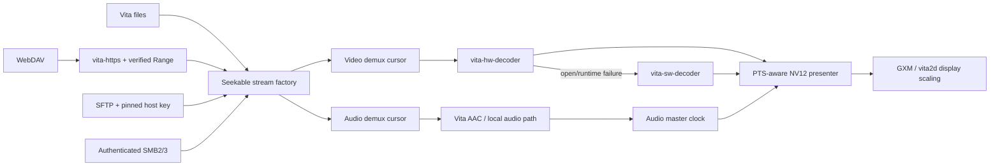

# VitaTube

[](LICENSE)

> [!IMPORTANT]
> **Public beta** — VitaTube is available publicly, but remains in active
> development. Expect rough edges and validate playback, network sources, and
> UI behavior on your own PlayStation Vita before relying on it day to day.

<p align="center">
  
</p>

<p align="center">
  <strong>A native local and authenticated-network media player for PlayStation Vita.</strong>
</p>

VitaTube plays video and music already owned and stored by the user. Media can
come from the Vita memory card or from an authenticated WebDAV, SFTP, or
SMB server. Browsing, demuxing, hardware decoding, audio/video synchronization,
and rendering all run on the console; no companion service is required.

VitaTube does not discover, acquire, export, convert, or copy media from online
catalogues. It has no account integration with third-party media platforms and
does not provide a download or audio-extraction feature.

> The local/network redesign is under active development. The application and
> reusable player module compile as a complete VPK, but the new remote backends
> still require broad validation on physical Vita hardware and different
> servers before a stable release is published.

## Highlights

- **Local media library:** indexes compatible files under `ux0:video`,
  `uma0:video`, `ux0:movies`, `uma0:movies`, `ux0:music`, and `uma0:music`
  without loading the whole
  collection into RAM.
- **Authenticated remote browsing:** connects to WebDAV over HTTPS, SFTP with
  verified host fingerprints, and authenticated SMB2/SMB3 shares.
- **Hardware H.264 decoding:** the complete public `h264_vita` FFmpeg backend is
  preferred, with software H.264 retained as a compatibility fallback.
- **Direct NV12 presentation:** decoded CDRAM surfaces are composed and scaled
  by GXM/vita2d instead of converting every frame to RGBA on the CPU.
- **Audio-master synchronization:** bounded queues, presentation-time ordering,
  late-frame recovery, and independent audio/video stream cursors keep playback
  synchronized.
- **Full-screen music player:** supports MP3 and other local audio formats,
  artwork, metadata, seeking, shuffle/repeat, animated backgrounds, and the
  persistent mini-player.
- **Packaged playback stack:** hardware decode, software fallback and HTTPS/TLS
  live in the independent `vita-hw-decoder`, `vita-sw-decoder` and `vita-https`
  repositories, each with an installable CMake target and minimal example.
- **Privacy-conscious state:** remote passwords live only for the active
  session and are never written to the source database.

## Media sources

| Source | Browsing and access contract | Current playback scope |
| --- | --- | --- |
| Local storage | Vita filesystem | Video and audio |
| WebDAV | HTTPS only, username/password, verified CA, byte-range support | Remote video |
| SFTP | Username/password plus explicitly confirmed SHA-256 host fingerprint | Remote video |
| SMB | Authenticated SMB2/SMB3 share with message signing required | Remote video |

Remote video currently requires a seekable MP4/M4V/MOV container with H.264
video and AAC audio. WebDAV servers must answer an actual one-byte Range probe
with `206 Partial Content`; an `Accept-Ranges` header alone is not accepted.
Every protocol factory creates independent cursors for the audio and video
demuxers.

Local audio detection currently includes MP3, M4A, AAC, and WAV. Local video
detection includes MP4, M4V, and MOV. Codec/container compatibility still
depends on the active Vita backend.

## Architecture



The player API never receives a URL. It receives a `VtDecoderStreamFactory` whose
`open` callback returns a new readable and seekable cursor. Protocol code owns
authentication and transport; the player owns demux, decode, synchronization,
and presentation. This boundary lets new transports be added without coupling
them to decoder internals.

The three standalone package READMEs document their public APIs, lifecycle and
copyable examples. VitaTube's `src/media/vita_decoder.c` is deliberately only a
small dispatcher: it opens the hardware package first and recreates the session
through the software package on either startup or delayed runtime failure.

## Network security model

- Saved source records contain protocol, endpoint, path, username, and the
  approved SFTP fingerprint; passwords are not serialized.
- WebDAV rejects clear-text `http://` endpoints and validates both the TLS
  certificate chain and hostname against the bundled CA store.
- SFTP refuses authenticated I/O until the displayed SHA-256 server fingerprint
  is copied back and confirmed by the user. A later mismatch stops the session.
- SMB guest access is not used and SMB message signing is required. Encryption
  remains a server/share policy; use SMB3 encryption when crossing an untrusted
  network.
- The application only reads remote media. It does not upload, rename, delete,
  or otherwise mutate remote files.

## Controls

The essential mapping is:

| Input | Browser | Video | Music |
| --- | --- | --- | --- |
| D-pad / left stick | Move focus | Seek left/right | Navigate/seek |
| Cross | Open/confirm | Pause/resume | Pause/resume |
| Circle | Back | Stop | Back/minimize |
| L1 | Open/close sections | Sections panel | Sections panel |
| R1 | Context actions | Playback/info panel | Playback/options panel |
| Right stick | — | Volume | Volume |
| Touch timeline | — | Seek | Seek |

Network Sources uses Square to add, Triangle to edit, and Select to remove a
saved server definition. Passwords are requested again when a source is opened.
Settings can swap the player-only L1/R1 panel mapping with D-pad Left/Right;
the historical L1/R1 panel mapping is the default.
The complete context-sensitive reference is in [CONTROLS.md](mds/CONTROLS.md).

## Data layout

Application state is stored below `ux0:data/VitaTube`:

```text
local_media.idx        paged local media index
playback_history.bin   local resume positions
settings.bin           application preferences
network/sources.bin    source definitions without passwords
session_log.txt        optional diagnostics when disk logging is enabled
```

The local index supports up to 65,536 items and loads only a bounded visible
page plus nearby artwork into memory.

## Building

### Requirements

- VitaSDK and the normal Vita system stubs
- Vita ports of vita2d, FreeType, libjpeg-turbo, libpng, zlib, bzip2, mpg123,
  Mbed TLS, libxml2, zstd, and libsmb2
- CMake, Git, Patch, and normal archive/build tools

Build the pinned release dependencies first:

```sh
export VITASDK=/absolute/path/to/vitasdk
export PATH="$VITASDK/bin:$PATH"

../vita-https/tools/build-curl-mbedtls.sh
./tools/build-libssh2-vita.sh
./tools/build-ffmpeg-vita-hw.sh
./tools/prepare-release-licenses.sh
```

Then build the application:

```sh
# Keep the four repositories as siblings (or override the three
# VITATUBE_*_PACKAGE CMake cache paths).
# VitaTube/  vita-hw-decoder/  vita-sw-decoder/  vita-https/
cmake -S . -B build -DCMAKE_BUILD_TYPE=Release
cmake --build build --parallel
unzip -t build/VitaTube.vpk
```

Release builds use Cortex-A9/NEON optimization, `-O3`, LTO for the final
application, function/data sections, and linker garbage collection. Exact
pinned revisions and configuration flags are recorded by the build scripts.
The ordinary VitaSDK libcurl/OpenSSL archives are deliberately not accepted;
HTTPS and SFTP both use Mbed TLS in a releasable build.

For a complete setup walkthrough, see
[TOOLCHAIN_SETUP.md](mds/setup/TOOLCHAIN_SETUP.md).

## Project structure

```text
../vita-hw-decoder/      standalone hardware player package
../vita-sw-decoder/      standalone software fallback package
../vita-https/           standalone HTTPS/TLS and Range-stream package
src/media/               player UI, audio, presentation and local playback
src/network/             WebDAV, SFTP and SMB stream factories
src/ui/                  local library, network browser and application UI
src/system/              clocks, display-awake and background-audio helpers
tools/                   reproducible dependency builders
mds/                     architecture, controls and development documents
```

## Known limitations

- Remote backends and their cancellation/error paths need validation across a
  representative server matrix on real hardware.
- Remote audio browsing is not exposed yet; the network section is video-only.
- The reusable player currently targets seekable H.264/AAC ISO-BMFF media.
- Some local formats recognized by the library may still be rejected when they
  do not satisfy the active decoder/container contract.
- SMB custom ports are not currently honored by the libsmb2 connection path;
  use the standard server port.
- The Vita display is 960×544. A 1280×720 source is decoded at source
  resolution and scaled only while GXM samples the NV12 surface for display.

## Documentation

- [Project specification](mds/PROJECT_SPECIFICATION.md)
- [Controls](mds/CONTROLS.md)
- [Development status](mds/DEVELOPMENT_LOG.md)
- [Hardware acceleration](mds/H264_ACCELERATION_RESEARCH_PLAN.md)
- [PS Vita hardware resources](mds/research/PSVITA_HARDWARE_GPU_RESOURCES.md)
- [Third-party notices](THIRD_PARTY_NOTICES.md)

## License

VitaTube is licensed under **GPL-3.0-only**. See [LICENSE](LICENSE).
Third-party components retain their own licenses and notices; see
[THIRD_PARTY_NOTICES.md](THIRD_PARTY_NOTICES.md).

VitaTube is an independent homebrew project. PlayStation, PS Vita, Sony, and
their related marks belong to their respective owners.

## Release hardening

Run `tools/release-audit.sh --vpk build/VitaTube.vpk` before distributing a
binary. Every VPK must be accompanied by the archive produced by
`tools/package-corresponding-source.sh` from the same checkout and dependency
prefixes. `release/VitaTube.spdx` is the release SBOM and is embedded in both
the VPK and the corresponding-source archive.

The existing private development history contains retired experiments and is
not a publication artifact. `tools/public-export.sh` creates a history-free
source snapshot. It does not push, publish or rewrite the local repository.

The optional CI binary job remains disabled until the repository owner sets
`VITATUBE_HW_REPOSITORY`, `VITATUBE_SW_REPOSITORY` and
`VITATUBE_HTTPS_REPOSITORY`. This keeps hosting names and publication timing
under the owner's control.
