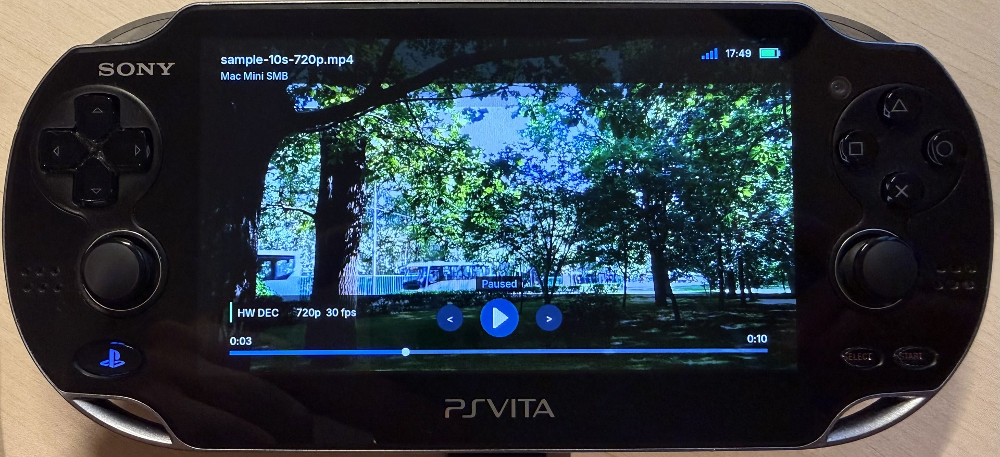
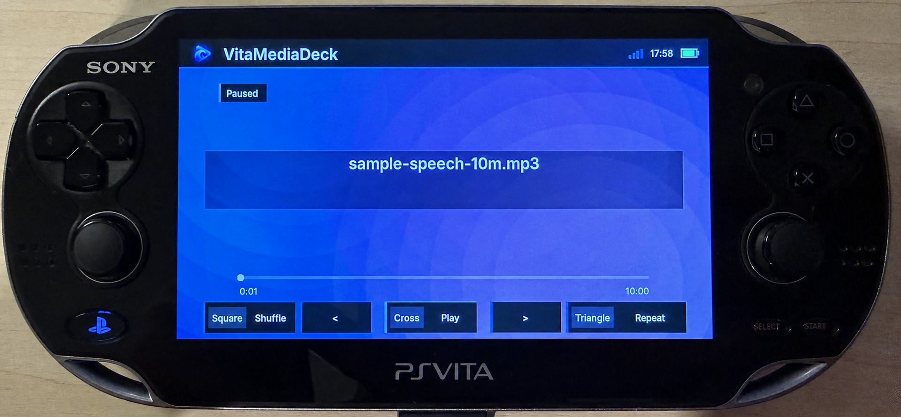
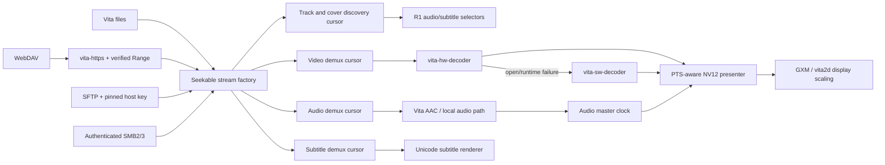

# VitaMediaDeck

[](LICENSE)

> [!IMPORTANT]
> **Public beta** — VitaMediaDeck is available publicly, but remains in active
> development. Expect rough edges and validate playback, network sources, and
> UI behavior on your own PlayStation Vita before relying on it day to day.

<p align="center">
  
</p>

<p align="center">
  <strong>A native local and authenticated-network media player for PlayStation Vita.</strong>
</p>

VitaMediaDeck plays video and music already owned and stored by the user. Media can
come from the Vita memory card or from an authenticated WebDAV, SFTP, or
SMB server. Browsing, demuxing, hardware decoding, audio/video synchronization,
and rendering all run on the console; no companion service is required.

VitaMediaDeck does not discover, acquire, export, convert, or copy media from online
catalogues. It has no account integration with third-party media platforms and
does not provide a download or audio-extraction feature.

The application UI follows the evolved **Spectral Reassembly** direction:
pitch-black OLED fields, spectral-white material, amber point-cloud projection,
restrained teal reflections, native Vita status surfaces, and deterministic
particle motion. Its design rationale and multilingual typography contract are
documented in
[`mds/UI_SIGNAL_SHELL.md`](mds/UI_SIGNAL_SHELL.md).

> The local/network redesign is under active development. The application and
> reusable player module compile as a complete VPK, but the new remote backends
> still require broad validation on physical Vita hardware and different
> servers before a stable release is published.

## VitaMediaDeck project family

VitaMediaDeck is the console application. Its runtime packages stay reusable,
and the optional transcoder runs only on a desktop computer:

| Repository | Responsibility | Included in the VPK |
| --- | --- | --- |
| [`VitaMediaDeck`](https://github.com/spyro-98/VitaMediaDeck) | Local/network library, Spectral Reassembly UI, subtitles, player orchestration, previews, and resume history | Application |
| [`vita-hw-decoder`](https://github.com/spyro-98/vita-hw-decoder) | Hardware-only H.264/AAC playback through `h264_vita`, SceVideodec, and direct NV12 presentation | Yes |
| [`vita-sw-decoder`](https://github.com/spyro-98/vita-sw-decoder) | CPU H.264 fallback with the same stream and lifecycle contract | Yes |
| [`vita-https`](https://github.com/spyro-98/vita-https) | Hardened HTTPS lifecycle, CA/SPKI verification, WebDAV requests, and seekable Range streams | Yes |
| [`VitaMediaDeck-Transcoder`](https://github.com/spyro-98/VitaMediaDeck-Transcoder) | Optional macOS/Windows/Linux conversion to the Vita-oriented H.264/AAC/Matroska profile | No |

No host tool is required for playback. The transcoder is useful when source
media does not already satisfy the Vita decoder contract, or when an embedded
cover and a predictable multi-track Matroska output are desired.

## Running on PlayStation Vita

<table>
  <tr>
    <td colspan="2" align="center">
      
    </td>
  </tr>
  <tr>
    <td colspan="2" align="center"><sub>Hardware H.264 decoder</sub></td>
  </tr>
  <tr>
    <td width="50%" align="center">
      
    </td>
    <td width="50%" align="center">
      
    </td>
  </tr>
  <tr>
    <td align="center"><sub>Software FFmpeg decoder</sub></td>
    <td align="center"><sub>Local music playback</sub></td>
  </tr>
</table>

These photographs document the decoder paths on real hardware. The current
Spectral Reassembly theme, expanded player panels, and new icon still need a
fresh physical-Vita screenshot pass.

## Highlights

- **Local media library:** indexes compatible files under `ux0:video`,
  `uma0:video`, `ux0:movies`, `uma0:movies`, `ux0:music`, and `uma0:music`
  without loading the whole
  collection into RAM.
- **Finder-style folder browser:** explores `ux0:` and `uma0:` directly and
  uses the same persistent grid/list choice as WebDAV, SFTP, and SMB folders.
- **Video cover previews:** local cells prefer matching artwork sidecars, then
  local and remote cells use an embedded cover when present or asynchronously
  extract and cache a representative H.264 frame. Indexed MP4/Matroska artwork
  is decoded directly from the container index; bounded stream discovery is
  reserved for inputs whose video parameters are actually incomplete.
- **Authenticated remote browsing:** connects to WebDAV over HTTPS, SFTP with
  verified host fingerprints, and authenticated SMB2/SMB3 shares.
- **Selectable H.264 decoding:** Settings offers Auto (hardware with software
  fallback), HW H.264 only, or SW FFmpeg only.
- **Multiple media tracks:** the playback panel discovers and switches between
  AAC audio streams and embedded SubRip, ASS/SSA, WebVTT, or MP4 timed-text
  subtitles without leaving the video. The same seekable-cursor path is used
  for local files, WebDAV, SFTP, and SMB. Left/Right stages a track choice and
  X applies it, preventing accidental playback restarts while browsing. Once
  opened, the subtitle cursor switches tracks and seeks in place, clears stale
  text immediately, and never blocks the UI while joining the previous reader.
- **Configurable multilingual subtitles:** a dedicated Settings tab controls
  font, foreground/background color, size, maximum width, minimum/maximum line
  count, and vertical position. Exact-size Inter faces keep Western and
  Cyrillic text crisp, while native PS Vita PGFs cover Japanese, Chinese, and
  Korean. A persistent OLED-black preview monitor renders the selected font,
  colors, size, safe width, row limits, and position with Western, Cyrillic,
  Japanese, Chinese, and Korean samples before playback.
- **Live video information:** the player HUD and right-side information panel
  show decoder, resolution, frame rate, and the stream-reported video bitrate.
- **Direct NV12 presentation:** decoded CDRAM surfaces are composed and scaled
  by GXM/vita2d instead of converting every frame to RGBA on the CPU.
- **Audio-master synchronization:** bounded queues, presentation-time ordering,
  late-frame recovery, and independent audio/video stream cursors keep playback
  synchronized.
- **Full-screen music player:** supports MP3 and other local audio formats,
  artwork, metadata, seeking, shuffle/repeat, animated backgrounds, and the
  persistent mini-player.
- **VitaTube player gestures restored:** a short Start minimizes local music,
  local video, and authenticated remote video; holding Start toggles the
  OLED-black ECO view, and Select
  immediately locks or unlocks input. Local video resumes fullscreen at the
  mini-player position with its selected audio/subtitle tracks restored. The
  video mini-player uses the main decoder for live frames and matching audio
  compatibility; tapping its media area expands it to one quarter of the
  screen width, while Start or the mini-player title restores fullscreen
  playback. The L1 sidebar exposes an **Active player** row above Home whenever
  a minimized music or video session can be restored. Choosing another L1 menu
  section from fullscreen performs the same background hand-off and navigates
  without stopping the active local movie, streamed movie, or music session.
- **Per-video resume history:** distinct local files and authenticated remote
  streams resume from their last useful position. When playback was recovered,
  the opening screen exposes **Play from beginning** immediately; once open,
  the R1 panel exposes **Start from beginning** and clears that saved point.
- **Packaged playback stack:** hardware decode, software fallback and HTTPS/TLS
  live in the independent `vita-hw-decoder`, `vita-sw-decoder` and `vita-https`
  repositories, each with an installable CMake target and minimal example.
- **Privacy-conscious state:** remote passwords are session-only by default.
  An explicit Settings opt-in stores them unencrypted at
  `ux0:data/VitaMediaDeck/network/passwords.txt`; the path and plaintext warning are
  displayed beside the toggle.

## Media sources

| Source | Browsing and access contract | Current playback scope |
| --- | --- | --- |
| Local storage | Vita filesystem | Video and audio |
| WebDAV | HTTPS only, username/password, public CA or explicitly confirmed SPKI pin, byte-range support | Remote video |
| SFTP | Username/password plus explicitly confirmed SHA-256 host fingerprint | Remote video |
| SMB | Authenticated SMB2/SMB3 share with message signing required | Remote video |

Remote video currently requires a seekable MP4/M4V/MOV or Matroska (`.mkv`)
container with H.264 video, optional AAC audio tracks, and optional embedded
UTF-8 text-subtitle tracks. WebDAV servers must answer
an actual one-byte Range probe with `206 Partial Content`; an `Accept-Ranges`
header alone is not accepted.
Every protocol factory creates independent cursors for track discovery, video,
the selected audio stream, and the selected subtitle stream. Subtitle reading
uses a bounded background cue queue so remote I/O never runs on the render loop.

Local audio detection currently includes MP3, M4A, AAC, and WAV. Local video
detection includes MP4, M4V, MOV, and MKV. Codec/container compatibility still
depends on the active Vita backend.

## Architecture



The player API never receives a URL. It receives a `VtDecoderStreamFactory` whose
`open` callback returns a new readable and seekable cursor. Protocol code owns
authentication and transport; the player owns demux, decode, synchronization,
and presentation. This boundary lets new transports be added without coupling
them to decoder internals.

The three runtime-package READMEs document their public APIs, lifecycle, and
copyable examples. The separate transcoder README documents the compatible
output profile but is not part of the console runtime. VitaMediaDeck's
`src/media/vita_decoder.c` is deliberately a small dispatcher: Auto opens the
hardware package first and recreates the session through the software package
on either startup or delayed runtime failure, while the two explicit Settings
choices force one backend. Track discovery and text-subtitle demux remain in
the app because neither standalone decoder package owns UI or subtitle policy.

## Network security model

- Saved source records contain protocol, endpoint, path, username, and approved
  SFTP/TLS fingerprints. Passwords are serialized only when the plaintext
  remember-passwords option is enabled.
- WebDAV rejects clear-text `http://` endpoints. Public servers validate the TLS
  certificate chain and hostname against the bundled CA store. A private or
  self-signed server is accepted only after its displayed SPKI SHA-256 pin is
  copied back and confirmed; a later key mismatch stops the session.
- SFTP refuses authenticated I/O until the displayed SHA-256 server fingerprint
  is copied back and confirmed by the user. A later mismatch stops the session.
- SMB guest access is not used and SMB message signing is required. Encryption
  remains a server/share policy; use SMB3 encryption when crossing an untrusted
  network.
- The application only reads remote media. It does not upload, rename, delete,
  or otherwise mutate remote files.

## Controls

The essential mapping is:

| Input | Browser | Video | Music |
| --- | --- | --- | --- |
| D-pad / left stick | Move focus | Seek left/right | Navigate/seek |
| Cross | Open/confirm | Pause/resume | Pause/resume |
| Circle | Back | Stop | Back/minimize |
| L1 | Open/close sections | Sections panel | Sections panel |
| R1 | Context actions or grid/list view | Playback/info panel | Playback/options panel |
| Right stick | — | Volume | Volume |
| Touch timeline | — | Seek | Seek |

Network Sources uses Square to add, Triangle to edit, and Select to remove a
saved server definition. A password can be entered in the add/edit form and is
kept for the application session; if it is absent, the app requests it when the
source is opened. The opt-in System setting can persist passwords unencrypted
and clearly advertises the storage path.
Settings can swap the player-only L1/R1 panel mapping with D-pad Left/Right;
the historical L1/R1 panel mapping is the default.
The complete context-sensitive reference is in [CONTROLS.md](mds/CONTROLS.md).

The Library R1 panel includes **Browse folders** for direct local filesystem
navigation. Local and remote folder browsers default to a four-column grid;
R1 switches both to a compact list and remembers the shared choice.
Folders and all files remain visible; compatible media uses the colored media
accent and can be played, while unsupported files remain read-only.
Dot-prefixed local files and folders stay hidden, matching Finder's default.
Video cells progressively replace their placeholder with a sidecar or embedded
cover, falling back to a representative frame generated by the bounded
thumbnail worker. Remote passwords are never written to the thumbnail cache.

## Data layout

Application state is stored below `ux0:data/VitaMediaDeck`:

```text
local_media.idx        paged local media index
playback_history.bin   local and remote resume positions
settings.bin           application preferences
network/sources.bin    source definitions without passwords
network/passwords.txt  optional plaintext passwords (explicit opt-in)
session_log.txt        optional diagnostics when disk logging is enabled
```

The local index supports up to 65,536 items and loads only a bounded visible
page plus nearby artwork into memory.

## Building

### Requirements

- VitaSDK and the normal Vita system stubs
- Vita ports of vita2d, FreeType, libjpeg-turbo, libpng, zlib, bzip2, mpg123,
  Mbed TLS, libxml2, zstd, and libsmb2
- CMake, Git, Patch, and normal archive/build tools

Build the pinned release dependencies first:

```sh
export VITASDK=/absolute/path/to/vitasdk
export PATH="$VITASDK/bin:$PATH"

../vita-https/tools/build-curl-mbedtls.sh
./tools/build-libssh2-vita.sh
./tools/build-ffmpeg-vita-hw.sh
./tools/prepare-release-licenses.sh
```

Then build the application:

```sh
# Keep the four repositories as siblings (or override the three
# VITAMEDIADECK_*_PACKAGE CMake cache paths).
# VitaMediaDeck/  vita-hw-decoder/  vita-sw-decoder/  vita-https/
cmake -S . -B build -DCMAKE_BUILD_TYPE=Release
cmake --build build --parallel
unzip -t build/VitaMediaDeck.vpk
```

Release builds use Cortex-A9/NEON optimization, `-O3`, LTO for the final
application, function/data sections, and linker garbage collection. Exact
pinned revisions and configuration flags are recorded by the build scripts.
The ordinary VitaSDK libcurl/OpenSSL archives are deliberately not accepted;
HTTPS and SFTP both use Mbed TLS in a releasable build.

For a complete setup walkthrough, see
[TOOLCHAIN_SETUP.md](mds/setup/TOOLCHAIN_SETUP.md).

## Local streaming test servers

Three read-only Python servers are included for testing the remote backends
directly against a Mac on the same LAN: WebDAV HTTPS with byte ranges, SFTP and
authenticated SMB2. Setup, copyable Terminal commands and the exact VitaMediaDeck
source fields are documented in
[tools/local_streaming/README.md](tools/local_streaming/README.md).

## Project structure

```text
../vita-hw-decoder/      standalone hardware player package
../vita-sw-decoder/      standalone software fallback package
../vita-https/           standalone HTTPS/TLS and Range-stream package
src/media/               player UI, audio, presentation and local playback
src/network/             WebDAV, SFTP and SMB stream factories
src/ui/                  local library, local/remote folder browsers and application UI
src/system/              clocks, display-awake and background-audio helpers
tools/                   dependency builders and local streaming test servers
mds/                     architecture, controls and development documents
```

## Known limitations

- Remote backends and their cancellation/error paths need validation across a
  representative server matrix on real hardware.
- Remote audio browsing is not exposed yet; the network section is video-only.
- The reusable player currently targets seekable H.264 media in ISO-BMFF or
  Matroska containers; AAC audio is supported when present.
- Bitmap subtitles such as PGS and VobSub may be retained by the transcoder but
  are not rendered by the current app. The selectable subtitle path supports
  SubRip, ASS/SSA text, WebVTT, MOV text, generic text, and MicroDVD.
- Some local formats recognized by the library may still be rejected when they
  do not satisfy the active decoder/container contract.
- The Vita display is 960×544. A 1280×720 source is decoded at source
  resolution and scaled only while GXM samples the NV12 surface for display.

## Documentation

- [Project specification](mds/PROJECT_SPECIFICATION.md)
- [Controls](mds/CONTROLS.md)
- [Development status](mds/DEVELOPMENT_LOG.md)
- [Hardware acceleration](mds/H264_ACCELERATION_RESEARCH_PLAN.md)
- [PS Vita hardware resources](mds/research/PSVITA_HARDWARE_GPU_RESOURCES.md)
- [Third-party notices](THIRD_PARTY_NOTICES.md)

## License

VitaMediaDeck is licensed under **GPL-3.0-only**. See [LICENSE](LICENSE).
Third-party components retain their own licenses and notices; see
[THIRD_PARTY_NOTICES.md](THIRD_PARTY_NOTICES.md).

VitaMediaDeck is an independent homebrew project. PlayStation, PS Vita, Sony, and
their related marks belong to their respective owners.

## Release hardening

Run `tools/release-audit.sh --vpk build/VitaMediaDeck.vpk` before distributing a
binary. Every VPK must be accompanied by the archive produced by
`tools/package-corresponding-source.sh` from the same checkout and dependency
prefixes. `release/VitaMediaDeck.spdx` is the release SBOM and is embedded in both
the VPK and the corresponding-source archive.

The existing private development history contains retired experiments and is
not a publication artifact. `tools/public-export.sh` creates a history-free
source snapshot. It does not push, publish or rewrite the local repository.

The optional CI binary job remains disabled until the repository owner sets
`VITAMEDIADECK_HW_REPOSITORY`, `VITAMEDIADECK_SW_REPOSITORY` and
`VITAMEDIADECK_HTTPS_REPOSITORY`. This keeps hosting names and publication timing
under the owner's control.
